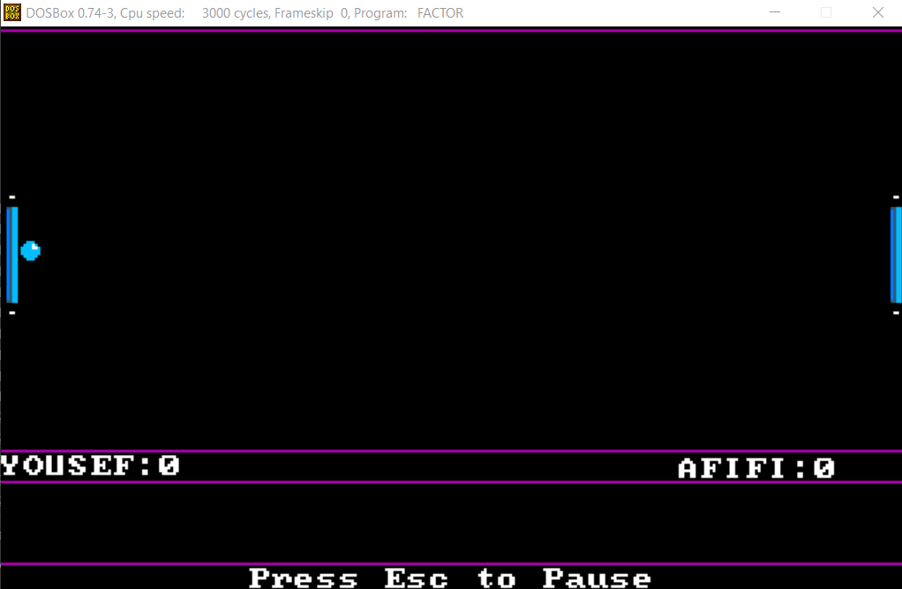

## **<u>Project Overview</u>**

This project uses assembly language to make the game pong from scratch as multiplayer using the same computer or different computers ( Through Serial Communication ).

The project was made by 5 people who all contributed in the coding and thinking of the flow of the code.

## **<u>How to play ?</u>**

When you start the game , you'll see the main menu from which you can choose one of several modes.

------

### **<u>Tutorial Mode</u>**

This is a single player mode in which you play against a computer in order to practice.

Here you only control the player on the left side using the up and down arrows while the player on the right follows the ball automatically and tries to win.

------

### **<u>Start Game</u>**

Clicking on start game will first ask you to enter the name of the 2 players.

after entering the names , you're asked to choose a game mode.

------

#### **<u>Normal Mode</u>**

This is the one that has the screenshot from above where the two players play normally and whoever scores gets a point.

------

#### **<u>Obstacle Mode</u>**

Obstacle mode has a third paddle floating in the middle and constantly moving up and down as the game moves on.

------

#### **<u>Portal Mode</u>**

This mode has two portals , if the ball goes into the red portals , it comes out from the blue portal with a different angle and vice verse.

------

#### **<u>Speed modes</u>**

You can also determine the speed of the ball throughout the game.

------

